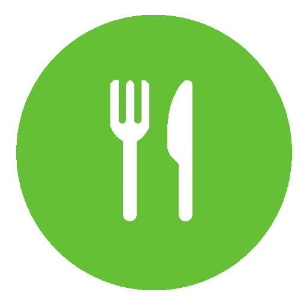

### Tytuł projektu:
 Eat&Share

### Opis:

Aplikacja ma na celu zbieranie danych od użytkowników na temat lokali gastronomicznych w Krakowie serwujących dania lub zestawy lunchowe w przystępnych cenach "na studencką kieszeń". Ceny będą głównym kryterium wyboru lokalu przez użytkownika, który w pierwszej kolejności ustala, ile maksymalnie chce wydać na jedzenie i wybiera lokal. Po wybraniu aplikacja pokaże drogę do lokalu z miejsca, w którym użytkownik się obecnie znajduje. Ceny są zbierane w bazie przez użytkowników: po wizycie w danym lokalu użytkownik dostaje zapytanie czy cena się zgadzała, jeżeli nie, to wprowadza nową, dzięki czemu inni użytkownicy są na bieżąco. Dodatkowo użytkownik będzie mógł dodać lokale do zakładki "ulubione" i do zakładki z miejscami, które chciałby odwiedzić bądź wypróbować.

### Skład zespołu:
-   Barbara Nogaś
-   Agnieszka Tuleta
-   Przemysław Krzyżak

### Raport

|Barbara Nogaś|h|Agnieszka Tuleta|h|Przemysław Krzyżak|h|
|-|-|-|-|-|-|
|Projektowanie layoutu i funkcjonalności aplikacji|3|Projektowanie layoutu i funkcjonalności aplikacji|3|Projektowanie layoutu i funkcjonalności aplikacji|3|
|Wykonanie prototypu|1|Front-end ekranów logowania, rejestracji i menu|7|Aktualizacja szkieletu|1|
|Wykonanie szkieletu pliku html| 0,5|Funkcje odpowiadające za front-end + rejestracja, logowanie, wylogowywanie|12|Front-end strony o autorach|0,5|
|Front-end ekranów home, pokaż drogę, dodaj lokal, dodaj cenę, twoje konto|10|Strona projektu na git|2|Obsługa Firebase|8|
|Funkcje obsługi dodawania/wyświetlania/usuwania rekordów z Firebase|10|||Obsługa Map|10|
||24,5||24||22,5|

	

### Prototyp

[Link do systemu zarządzania projektem](https://trello.com/b/FygUN620/eatshare)
